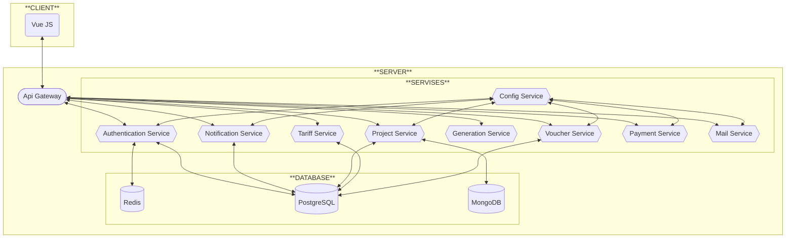

# 📃Описание
Проект для изучения процесса
создания приложения на микросервисной архитектуре
с использованием GraphQL и Vue.\
Сервис для проектирования БД.
## 🔥Основные моменты
* 🔶Spring
* 🔶Vue
* 🔶GraphQL
    * 🔶Validation
    * 🔶Custom Types
        * 🔶Local Date Time
* 🔶Microservices
* 🔶JWT-Authentication
# 📗Требования
- [ ] Аутентификация с помощью JWT-токенов (по email и паролю)
- [ ] Запуск через docker compose
- [ ] Сервисы должны иметь общую точку входа
- [ ] В качестве протокола взаимодействия должен использоваться GraphQL
# 🎨Структура

# 🔧Стек технологий

<details>
<summary>
<big>БД</big>
</summary>

* Redis
* PostgreSQL
* MongoDB

</details>

<details>
<summary>
<big>Config Service</big>
</summary>

### Spring Зависимости

* Cloud Config Server
* Actuator

</details>

<details>
<summary>
<big>Eureka Service</big>
</summary>

### Spring Зависимости

* Eureka Server
* Cloud Config Client

</details>

<details>
<summary>
<big>API Gateway</big>
</summary>

### Spring Зависимости

* Cloud API Gateway
* Eureka Client
* Config Client

</details>

# 📚Документация
# 📈Тесты
# 🚩Запуск и развертывание
Для запуска на компьютере должен быть установлен и запущен Docker.

<table>
    <tr>
        <th colspan="2">Сервис</th>
        <th colspan="2">Порт</th>
    </tr>
    <tr>
        <th>Описание</th>
        <th>Название</th>
        <th>Хост</th>
        <th>Контейнер</th>
    </tr>
    <tr>
        <td>Vue (NGINX)</td>
        <td>frontend</td>
        <td colspan="2">80</td>
    </tr>
    <tr>
        <td>API Gateway</td>
        <td>api-gateway</td>
        <td colspan="2">8080</td>
    </tr>
    <tr>
        <td>Config Server</td>
        <td>config-service</td>
        <td></td>
        <td>8888</td>
    </tr>
    <tr>
        <td>Eureka Server</td>
        <td>discovery-service</td>
        <td></td>
        <td>8761</td>
    </tr>
</table>

Первый запуск (команды выполняются в директории с `compose.yaml`)
```bat
docker compose up --build
```
Все последующие запуски
```bat
docker compose up
```
